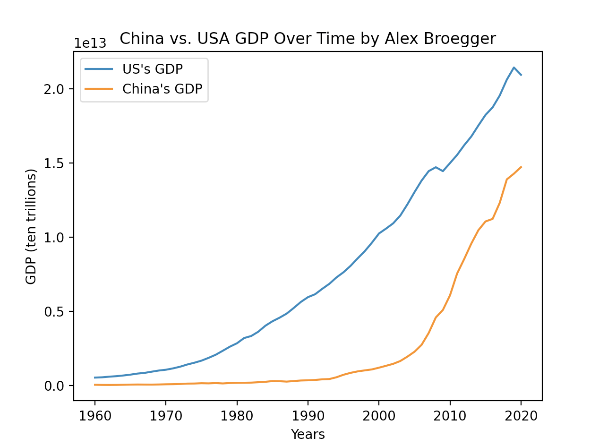

# Data Visualitzaiton

## China vs. USA GDP Statistics Over Time

 

The graph above displays the GDP trend line for both China and the United States. The years of GDP data ranges from 1960 to 2020. By looking at the graph, it is evident that the United States has maintained a higher GDP than China since 1960.  

Here is a link to the original data source for [China](http://api.worldbank.org/v2/countries/CHN/indicators/SP.POP.TOTL?per_page=5000&format=json) and the [United States](http://api.worldbank.org/v2/countries/USA/indicators/NY.GDP.MKTP.CD?per_page=5000&format=json).

## Current Astronauts in Space on ISS vs. Shenzhou 13 

 

The pie chart above displays the percentage of astronauts in space currently on the ISS (International Space Station) vs. Shenzhou 13. By looking at the pie chart, it is evident that a majority of the astronauts in space are currently living on the International Space Station (70%) compared to Shenzhou 13 (30%). 

Here is a [link](http://api.open-notify.org/astros.json) to the original data source.

If you would like to look at the project instructions, here is the [link](https://github.com/mikeizbicki/cmc-csci040/tree/2021fall/hw_02).
